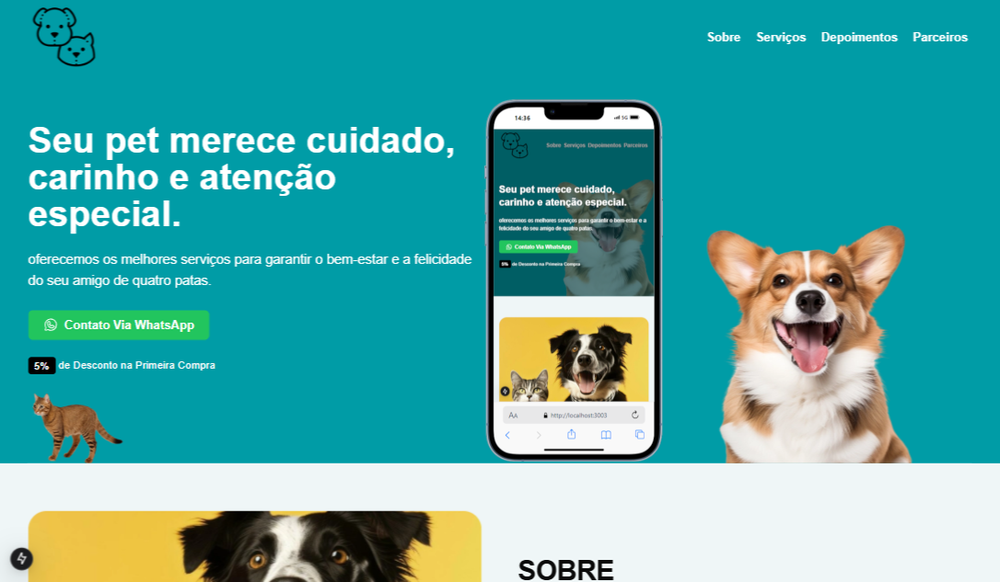
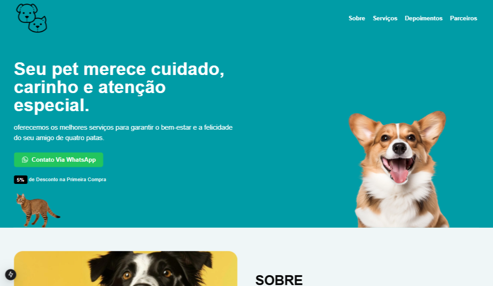

# PETSHOP



## Descrição 
 Page desenvolvida em Next.JS, oferece uma experiência dinâmica, com sessões em movimento durante o scroll, proporcionando uma navegação fluida e interativa. Seu design responsivo e moderno foi pensado para otimizar a experiência do usuário, criando uma atmosfera agradável e envolvente.

### Objetivo 

Tem como objetivo oferecer uma plataforma de fácil navegação, otimizada para desempenho e acessibilidade, criando uma experiência satisfatória.

## Demostração do Layout 



## Como Utilizar 

1. **Clone o Repositório**

```bash
 git clone ENDEREÇO REPOSITÓRIO
```
2. **Rodar**
- Entrar na pasta raiz utilizando terminal !
```bash
cd PASTA

 npm run dev
```


## Tecnologias Utilizadas 

1.JavaScript 

2.TailWind 

3.Next 

## Autor

[Abreeu](https://www.linkedin.com/in/abreeu/)


## Licença

Este projeto está sob a licença MIT. Você é livre para usá-lo como quiser, tanto para uso pessoal quanto comercial.


